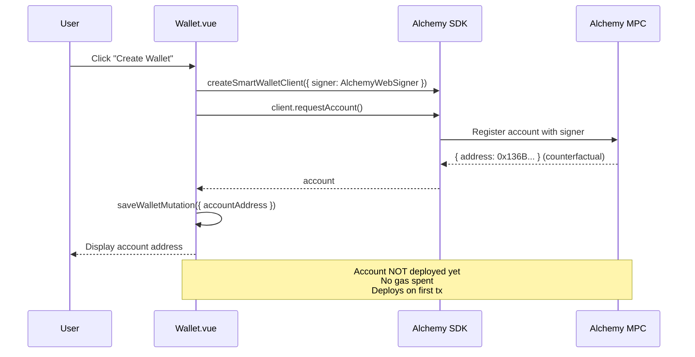
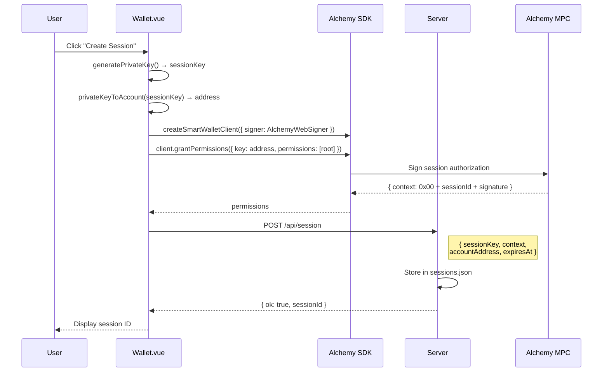
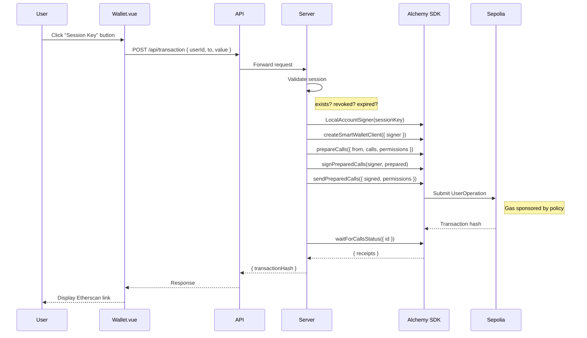

# Session Key Transaction Flow

## Overview

This document describes how transactions are sent using session keys - delegated signing where the server holds an ephemeral key to sign on behalf of the user.

## Architecture

```
+--[ FRONTEND (Vue) ]----------------------------------------------+
|                                                                  |
|  Wallet.vue:sendTransaction()                                    |
|    |                                                             |
|    v                                                             |
|  useSessionData.ts:sendTransactionMutation()                     |
|    |                                                             |
|    v                                                             |
|  session.ts:POST /api/transaction { userId, to, value, data }    |
|                                                                  |
+------------------------------------------------------------------+
                              |
                              | HTTPS
                              v
+--[ BACKEND (Express) ]-------------------------------------------+
|                                                                  |
|  server/index.ts:POST /api/transaction                           |
|                                                                  |
|  1. Validate session (exists, not revoked, not expired)          |
|  2. Create signer: LocalAccountSigner(sessionKey)                |
|  3. Create client: createSmartWalletClient({ signer, policyId }) |
|  4. Prepare: client.prepareCalls({ from, calls, permissions })   |
|  5. Sign: signPreparedCalls(signer, preparedCalls)               |
|  6. Send: client.sendPreparedCalls({ signed, permissions })      |
|  7. Wait: client.waitForCallsStatus({ id })                      |
|                                                                  |
+------------------------------------------------------------------+
                              |
                              | Alchemy Wallet API
                              v
+--[ ALCHEMY INFRASTRUCTURE ]--------------------------------------+
|                                                                  |
|  - Validates session key signature against permissions context   |
|  - Validates permissions (root = full access)                    |
|  - Sponsors gas via Gas Manager Policy                           |
|  - Submits UserOperation to bundler                              |
|  - Executes on Sepolia testnet                                   |
|                                                                  |
+------------------------------------------------------------------+
```

## Sequence Diagrams

### 1. Wallet Creation (Counterfactual)



### 2. Session Key Creation



### 3. Send Transaction via Session Key



## Key Files

| File | Purpose |
|------|---------|
| `app/src/views/Wallet.vue:282-307` | UI trigger, calls mutation |
| `app/src/composables/useSessionData.ts:38-41` | Pinia Colada mutation wrapper |
| `app/src/api/session.ts:76-100` | HTTP POST to server |
| `server/src/index.ts:265-352` | Session validation + Alchemy SDK calls |

## Data Flow

### 1. Frontend Trigger (Wallet.vue:282-307)

```typescript
async function sendTransaction() {
  const result = await sendTransactionMutation({
    to: recipientAddress.value,
    value: parseEther(amount.value).toString(),
    data: "0x",
  });
  txHash.value = result.transactionHash;
}
```

### 2. API Call (session.ts:76-100)

```typescript
export async function sendTransaction(params: {
  userId: string;
  to: string;
  value: string;
  data?: string;
}) {
  const response = await fetch(`${API_URL}/api/transaction`, {
    method: "POST",
    headers: { "Content-Type": "application/json" },
    body: JSON.stringify(params),
  });
  return response.json();
}
```

### 3. Server Processing (index.ts:265-352)

```typescript
app.post("/api/transaction", async (req, res) => {
  const { userId, to, value, data } = req.body;
  const session = sessions.get(userId);

  // Validate session
  if (!session) return res.status(404).json({ error: "No session found" });
  if (session.revoked) return res.status(403).json({ error: "Session revoked" });
  if (Date.now() > session.expiresAt) return res.status(403).json({ error: "Session expired" });

  // Create signer from stored session key
  const sessionSigner = LocalAccountSigner.privateKeyToAccountSigner(session.sessionKey);

  // Create client
  const client = createSmartWalletClient({
    transport: alchemy({ apiKey: ALCHEMY_API_KEY }),
    chain: sepolia,
    signer: sessionSigner,
    policyId: ALCHEMY_GAS_POLICY_ID,
  });

  // Permissions context from session creation
  const permissions = { context: session.permissionsContext };

  // Prepare, sign, send
  const preparedCalls = await client.prepareCalls({
    from: session.accountAddress,
    calls: [{ to, value, data }],
    capabilities: { permissions, paymasterService: { policyId } },
  });

  const signedCalls = await signPreparedCalls(sessionSigner, preparedCalls);
  const result = await client.sendPreparedCalls({
    ...signedCalls,
    capabilities: { permissions },
  });

  // Wait and return
  const txResult = await client.waitForCallsStatus({ id: result.preparedCallIds[0] });
  res.json({ transactionHash: txResult.receipts[0].transactionHash });
});
```

## Session Data Structure

Stored in `server/data/sessions.json`:

```typescript
{
  "userId": {
    "sessionId": "0x87b429539287b64dd116877e73b87317",
    "sessionKey": "0x17e1286a...",              // Private key (SENSITIVE)
    "sessionKeyAddress": "0xB33E5a1d...",       // Derived address
    "accountAddress": "0x136B292F...",          // Smart wallet address
    "signature": "0x30d9308d35a418...",         // Owner's authorization
    "permissionsContext": "0x0087b429...",      // Full context for Alchemy
    "permissions": [{ "type": "root" }],        // Permission scope
    "expiresAt": 1764664077000,                 // Unix timestamp ms
    "revoked": false
  }
}
```

## Permissions Context Format

```
0x00 + sessionId (16 bytes) + ownerSignature (65 bytes)
│      │                      │
│      │                      └─ Owner's authorization of this session
│      └─ Unique session identifier
└─ Mode byte (0x00 = remote/delegated)
```

## Security Notes

1. **Session Key Storage**: Currently filesystem (`sessions.json`). Production should use KMS.
2. **Session Expiry**: 24 hours default, validated on every transaction.
3. **Revocation**: Instant via `DELETE /api/session/:userId`.
4. **Permissions**: Currently `root` (full access). Can be scoped to specific contracts/methods.
5. **Gas Sponsorship**: All fees paid by Alchemy Gas Manager policy.

## Dependencies

```
@account-kit/wallet-client  → createSmartWalletClient, signPreparedCalls
@account-kit/infra          → sepolia, alchemy transport
@aa-sdk/core                → LocalAccountSigner
viem                        → parseEther, getAddress, Hex types
```
